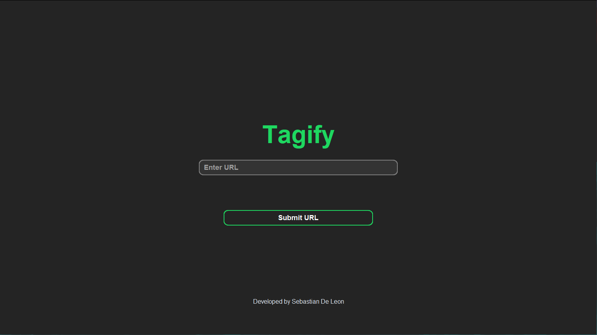
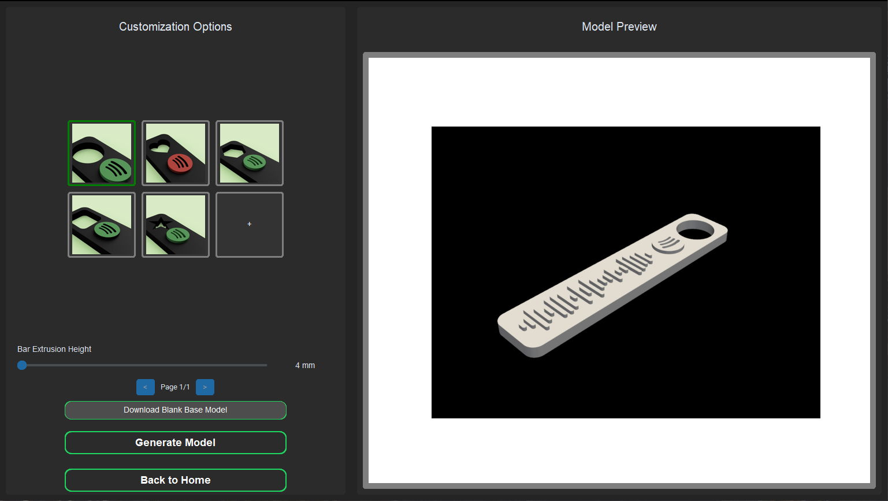
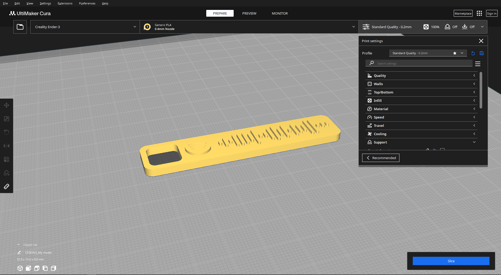

# Printune

Printune is a desktop application for generating 3D printable Spotify code tags.

## Images
---

*Main application welcome screen.*


*Model customization options and preview.*


*Example of a generated 3D model ready for export.*
## Project Structure

- `main.py` - Entry point. Starts the application.
- `ui.py` - Contains the `PrintuneApp` class and all UI logic.
- `modeling.py` - Handles 3D model generation and export.
- `utils.py` - Utility functions (Spotify parsing, web links, etc).
- `assets/` - Contains images, GIFs, and base models.
- `base-models/` - STEP files for base models.

---

## Function Documentation

### `main.py`

- **No user-defined functions.**  
  This file only imports and runs `PrintuneApp` from `ui.py`.

---

### `ui.py`

#### class PrintuneApp(CTk)
Main application class for Printune. Handles all UI components and user interactions.

- **`__init__(self)`**  
  Initializes the main window, sets up state variables, and calls `create_frames()` and `show_home_page()`.

- **`create_frames(self)`**  
  Create and configure all frames and widgets for the application, including home and customization pages, model selection, and preview panel.

- **`on_resize(self, event)`**  
  Redraws base model buttons with new size if window size changes significantly.

- **`_on_base_model_select_resize(self, idx)`**  
  Handles base model selection when resizing, updates button borders and preview.

- **`show_home_page(self)`**  
  Displays the home page and hides the customization page.

- **`show_customization_page(self)`**  
  Displays the customization page and hides the home page.

- **`process_url(self)`**  
  Processes the Spotify URL from the input field, fetches and parses the Spotify code, extracts bar heights, and switches to the customization page.

- **`export_model(self)`**  
  Generates the model using the selected base model and bar heights, then prompts the user to save the STL file.

- **`show_loading_gif(self)`**  
  Displays a loading GIF in the preview frame while the model is being generated.

- **`update_model_preview(self)`**  
  Updates the 3D preview in the preview frame with a loading indicator, generates the model in a background thread, and displays the rendered preview.

---

### `modeling.py`

#### `generate_model_without_export(bar_heights, selected_base_model)`
Generate the model in memory without exporting it.  
**Args:**  
- `bar_heights`: List of bar heights extracted from the Spotify code image.  
- `selected_base_model`: Path to the selected STEP file.  
**Returns:**  
- A CadQuery Workplane object representing the generated model, or `None` on error.

#### `export_model(model, file_path)`
Export the given CadQuery model to an STL file.  
**Args:**  
- `model`: CadQuery Workplane object to export.  
- `file_path`: Path to save the STL file.

---

### `utils.py`

#### `open_link(url)`
Open the given URL in the default web browser.  
**Args:**  
- `url`: The URL to open.

#### `get_link_data(share_link)`
Parse the Spotify share link and return relevant data.  
**Args:**  
- `share_link`: The Spotify share link (string).  
**Returns:**  
- Tuple of (type, id) if found (e.g., `("track", "123...")`), otherwise `None`.

---

## Requirements

- Python 3.8 or higher
- Internet connection (for fetching Spotify codes)
- Dependencies listed in `requirements.txt`

## Installation

1. Clone this repository:
   ```
   git clone https://github.com/yourusername/Printune.git
   cd Printune
   ```

2. Install required dependencies:
   ```
   pip install -r requirements.txt
   ```

## How to Run

1. Launch the application:
   ```
   python main.py
   ```

2. The main window will appear with a welcome screen.

## Usage Guide

1. **Input a Spotify Link**
   - Paste a Spotify share URL for any track, album, or playlist
   - Click "Generate" to process the link

2. **Customize Your Model**
   - Select from available base models in the gallery
   - Adjust any customization options
   - Preview the model in real-time

3. **Export and Print**
   - Click "Export" to save your model as an STL file
   - Open the STL file with your preferred slicer software
   - Print on your 3D printer with recommended settings:
     - Layer Height: 0.2mm
     - Infill: 15-20%
     - Supports: As needed based on model complexity

## Features

- **Spotify Code Generation**: Automatically extracts code patterns from any Spotify link
- **Multiple Base Models**: Choose from several pre-designed bases for your code
- **Real-time 3D Preview**: See your model before exporting
- **Custom Model Support**: Import your own base models (STEP format)
- **STL Export**: Export directly to 3D-printable STL format

## Troubleshooting

- **Invalid URL Error**: Ensure you're using a proper Spotify share link
- **Model Generation Failure**: Check your internet connection
- **Preview Not Showing**: Make sure all dependencies are correctly installed

---

## Extending

- Add new base models to `base-models/`.
- Customize model generation in `modeling.py`.
- UI changes go in `ui.py`.

---

## License

MIT License.
